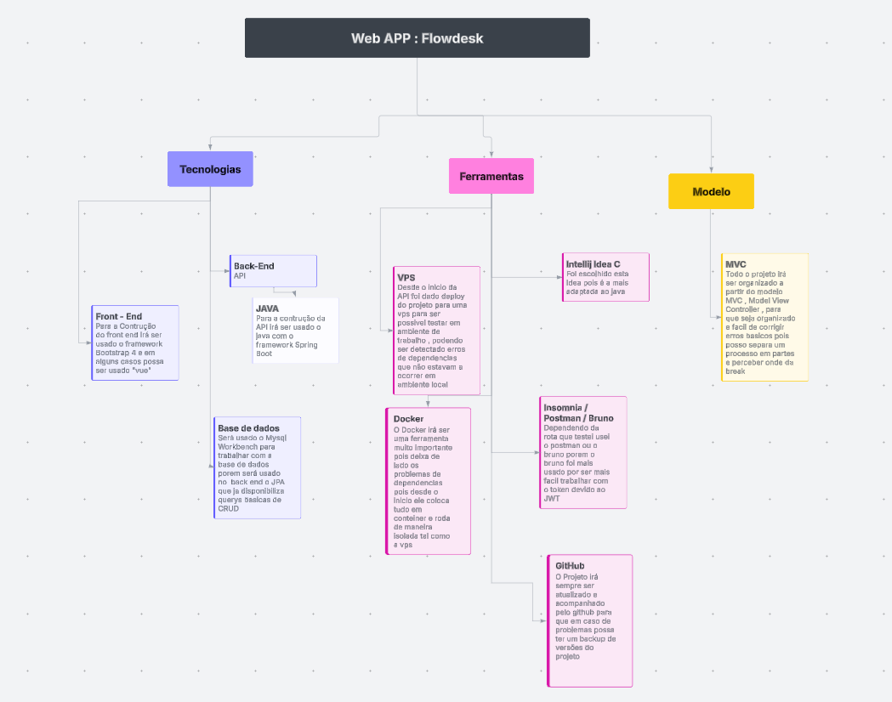

# Flowdesk v1

## 📌 Visão Geral

O **Flowdesk** é uma aplicação web desenvolvida para melhorar a comunicação entre equipas técnicas (desenvolvedores) e colaboradores de pequenas e médias empresas.  
O sistema combina **gestão de tickets**, **chat interno**, **assistência remota** e um **backoffice administrativo**, tudo suportado por um back-end seguro e estruturado em Java.

O objetivo principal é garantir um suporte técnico mais rápido, claro e organizado, eliminando falhas de comunicação e centralizando toda a informação num só local.

---

## 🔧 Funcionalidades Principais

- **Autenticação com JWT**  
  Login seguro, baseado em JSON Web Tokens, garantindo proteção e controlo de acessos.

- **Sistema de Tickets**  
  Criação, edição, atribuição, prioridades, estados e histórico completo.

- **Chat Integrado por Ticket**  
  Cada ticket inclui um chat dedicado, permitindo comunicação clara entre colaborador e técnico.

- **Assistência Remota**  
  Possibilidade de acesso remoto à máquina do utilizador (mediante autorização), ideal para problemas complexos.

- **Backoffice / Administração**  
  Gestão de utilizadores, permissões, departamentos e personalização da empresa.

- **Dashboard e Estatísticas**  
  Indicadores como: nº de tickets, tempo médio de resolução, atividade da equipa, etc.

---

## 🧱 Tecnologias Utilizadas

### **Back-end**
- Java
- JSON Web Token (JWT) para autenticação
- JPA 
- Maven

### **Front-end**
- HTML5
- CSS3
- Bootstrap 4
- JS 

### **Base de Dados**
- MySQL

### **Deploy**
- VPS (Servidor próprio)
- Docker
- Docker Compose

---

## 🏛️ Arquitetura da Aplicação

A aplicação segue uma arquitetura organizada em camadas:

- **Controllers**  
  Recebem e tratam pedidos HTTP.

- **Services**  
  Contêm a lógica de negócio.

- **Repositories / DAOs**  
  Responsáveis por interagir com a base de dados MySQL.

- **Entidades / Modelos**  
  Representam a estrutura dos dados (Users, Tickets, Mensagens, etc).

- **Segurança**
    - Filtros JWT
    - Validação de permissões
    - Gestão de sessões e renovação de tokens

---

---

